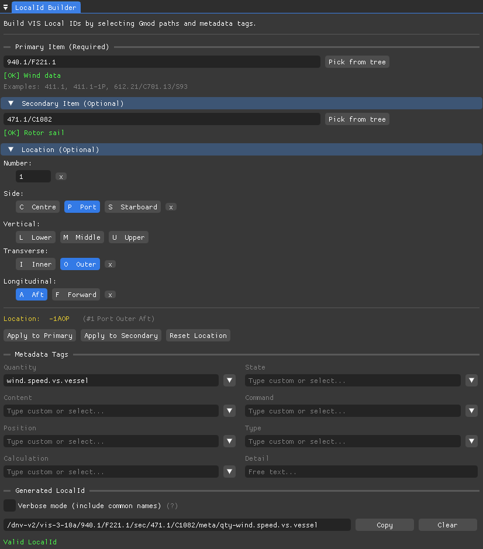

# vista-explorer

A playground to experiment with the unofficial DNV Vista C++ SDK.

<p align="center">
  
</p>

<p align="center">
  
</p>

## Features

### Gmod Viewer
- Browse Gmod trees across VIS versions (v3.4a through v3.10a), matching the [official DNV web interface](https://vista.dnv.com/gmod)
- Product Types display with parent function code (green) and type code (red)
- Node details: full/short path, metadata, definition, hierarchy

### LocalId Builder
- Compose VIS Local IDs interactively
- Primary and secondary Gmod path input with real-time validation
- Location builder: Number, Side, Vertical, Transverse, Longitudinal — applied to the correct individualisable node
- Metadata tags (Quantity, Content, Position, Calculation, State, Command, Type, Detail) with standard value picker
- Verbose mode (common names in path)
- Live LocalId preview with SDK validation

## Building

```bash
cmake -B build -G Ninja
ninja -C build
./build/bin/nfx-vista-explorer
```

## Requirements

- C++20 compiler (Clang 19+)
- CMake 3.20+
- OpenGL 4.5+

## Dependencies (fetched automatically via CMake)
- [DNV Vista SDK](https://github.com/nfx-opensource/vista-sdk/tree/feature/cpp/) (C++ branch, unofficial fork) - MIT
- [Official DNV Vista SDK](https://github.com/dnv-opensource/vista-sdk) - MIT
- [ImGui](https://github.com/ocornut/imgui) (docking branch) - MIT
- [GLFW](https://github.com/glfw/glfw) - Zlib
